WILD 562 Lab4 : Categorical Covariates
================
Mark Hebblewhite
February 02, 2023

# Lab 4: Categorical Resource Selection

General introduction to the biological rationale of this lab was given
in the Lab 2 and 3 lab introductions. In Lab 4, we extend the analysis
of habitat use by wolves in two wolf packs from 2001-2005 in Banff
National Park to multivariate analysis of categorical habitat selection
using multiple logistic regressions to estimate a resource selection
function (RSF) as a function of the availability of different landcover
resources.

The learning objectives of today’s lab are; 1) Data management and
processing - a) Process spatial landcover data and make it ready for
extraction to a dataframe building on labs 1, 2 and 3. Processing
distance to high human use as well. b) Adding XY coordinates to our wolf
data frame by running code from source, and then re-building a new
dataframe with the new landcover and distance to high human use data
attached to the wolfkde dataframe.

2)  Review how to summarize coefficients from large numbers of models.
3)  Conduct selection ratio’ analysis using the proportional use and
    availabilities of our wolfkde dataset.
4)  Conduct categorical resource selection using logistic regression.
5)  Gain an appreciation for the influence of changing the reference
    category on the model.

## Preliminaries - Loading Packages

Note I have supressed the output from loading packages to save space.
This week we will load these packages:

`packages <- c("tidyverse", "adehabitatHS", "adehabitatHR", "mapview", "tmap", "sf","terra", "here","ggplot2","colorRamps", "stars")`

# Importing Landcover Map from an ArcGIS

In the first activity we learn how to import an ARCGIS Raster file in a
GRID file format, and, hence, folder with associated structure called:
Landcover/ . For more background learn about spatial data analysis in R
from this great website [R spatial data
analysis](http://rspatial.org/spatial/index.html)

For background, today we are going to do categorical resource selection
using a typical kind of landcover model. Note that I am very specific
here in my language - the use of the term landcover - for good reason.
Most wildlife ecologists have a weak understanding of where various
landcover data come from, the history of the field of landcover
classification, or how or where its assumptions may affect wildlife
habitat modeling.

Most modern day ‘vegetation classification maps’ are actually not
vegetation, but are derived based on remotely-sensed data from
satellites. The most common is the LANDSAT series 1 - 7 30meter
satellite data products. This is why it is more correct to call these
landcover, not vegetation, classification systems because they are based
on surface reflectance values in the visible and non-visible light
spectra, which include non-vegetated surfaces such as urban areas,
pavement, rocks, ice, lakes, clouds ( a big problem), etc. Common
examples that many of us might use here in Montana or the lower 48 are
LANDFIRE, National Landcover Classification Database (NLCD), etc.

For background, I highly recommend every ecologist who uses such
remotely-sensed landcover-type data become familiar with how they are
generated so that you know when and how to use them wisely. I highly
recommend this book for a gentle introduction to the field Ecological :
[Remote Sensing and GIS for Ecologists using Open Source
Software](http://book.ecosens.org/content/)

In particular, the following Chapter 8: Land Cover or Image
Classification Approaches. Chapter 8 explains how to conduct image
classification: classification principles, classification types
(un-supervised and supervised approaches), and usage in real-world
examples: land cover vs. land use classification will be discussed, as
well as practical examples of collecting training samples, generating a
landcover classification using R, evaluating a land cover classification
(accuracy assessment, statistics) and accuracy assessment of
classification results.

Moreover, I have also included as background reading an early seminal
paper by a colleague of mine, Greg McDermid (now a professor in
Geomatics at University of Calgary) that provides the average ecologist
a good general background.

*References*

Hebblewhite, M. (2006) Linking predation risk and forage to ungulate
population dynamics. University of Alberta. Appendix 2A: Landcover
mapping for the Ya Ha Tinda elk and wolf project study area.

McDermid, G.J., Franklin, S.E. & LeDrew, E.F. (2005) Remote sensing for
large-area habitat mapping. Progress in Physical Geography, 29, 449-474.

Wegmann, M., Leutner, B. & Dech, S. (2016) Remote Sensing and GIS for
Ecologists using Open Source Software, Pelagic Publishers, Exeter, UK.

## Loading and Manipulating Landcover Data

``` r
landcover<-rast(here::here("Data","landcover"))
image(landcover, col=rainbow(16))
```

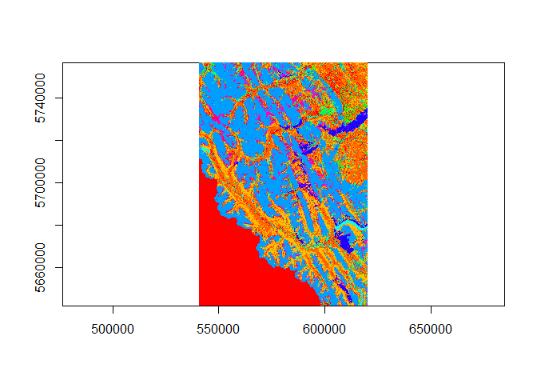<!-- -->

``` r
landcover
```

    ## class       : SpatRaster 
    ## dimensions  : 3811, 2652, 1  (nrow, ncol, nlyr)
    ## resolution  : 30, 30  (x, y)
    ## extent      : 540827.8, 620387.8, 5642002, 5756332  (xmin, xmax, ymin, ymax)
    ## coord. ref. : +proj=utm +zone=11 +datum=NAD83 +units=m +no_defs 
    ## source      : landcover 
    ## name        : landcover 
    ## min value   :         0 
    ## max value   :        16

``` r
cats(landcover)
```

    ## [[1]]
    ## NULL

``` r
head(values(landcover))
```

    ##      landcover
    ## [1,]        10
    ## [2,]        10
    ## [3,]        10
    ## [4,]        10
    ## [5,]        10
    ## [6,]        10

``` r
levels(landcover)
```

    ## [[1]]
    ## [1] ""

``` r
##Note we do not have access to the attributes table of HABITATTYPE -- so we have to create one, here we create the legend of HABITATTYPE to ID using previous version of lab 4.

ID <- 0:16
HABITATTYPE <- c("","Open Conifer","Moderate Conifer","Closed Conifer", "Deciduous", "Mixed Forest",
                  "Regeneration","Herbaceous","Shrub","Water","Rock-Ice","Cloud","Burn-Forest",
                  "Burn-Grassland", "Burn-Shrub","Alpine Herb","Alpine Shrub")
values <- as.data.frame(ID) %>% 
  add_column(HABITATTYPE)

#Use the levels function from terra to set the associated HABITAT TYPE attributes

levels(landcover) <- values
cats(landcover)
```

    ## [[1]]
    ##    ID      HABITATTYPE
    ## 1   0                 
    ## 2   1     Open Conifer
    ## 3   2 Moderate Conifer
    ## 4   3   Closed Conifer
    ## 5   4        Deciduous
    ## 6   5     Mixed Forest
    ## 7   6     Regeneration
    ## 8   7       Herbaceous
    ## 9   8            Shrub
    ## 10  9            Water
    ## 11 10         Rock-Ice
    ## 12 11            Cloud
    ## 13 12      Burn-Forest
    ## 14 13   Burn-Grassland
    ## 15 14       Burn-Shrub
    ## 16 15      Alpine Herb
    ## 17 16     Alpine Shrub

Note that this ‘legend’ is what we want to keep track of as we transform
the data to a GTiff below.

``` r
landcover
```

    ## class       : SpatRaster 
    ## dimensions  : 3811, 2652, 1  (nrow, ncol, nlyr)
    ## resolution  : 30, 30  (x, y)
    ## extent      : 540827.8, 620387.8, 5642002, 5756332  (xmin, xmax, ymin, ymax)
    ## coord. ref. : +proj=utm +zone=11 +datum=NAD83 +units=m +no_defs 
    ## source      : landcover 
    ## categories  : HABITATTYPE 
    ## name        :  HABITATTYPE 
    ## min value   :              
    ## max value   : Alpine Shrub

``` r
writeRaster(landcover, here::here("Output","landcover16.tif"), overwrite = TRUE)
landcover16 <- rast(here::here("Output","landcover16.tif")) # bringing it back in
landcover16
```

    ## class       : SpatRaster 
    ## dimensions  : 3811, 2652, 1  (nrow, ncol, nlyr)
    ## resolution  : 30, 30  (x, y)
    ## extent      : 540827.8, 620387.8, 5642002, 5756332  (xmin, xmax, ymin, ymax)
    ## coord. ref. : NAD83 / UTM zone 11N (EPSG:26911) 
    ## source      : landcover16.tif 
    ## categories  : HABITATTYPE 
    ## name        :  HABITATTYPE 
    ## min value   :           NA 
    ## max value   : Alpine Shrub

``` r
cats(landcover16)
```

    ## [[1]]
    ##    value      HABITATTYPE
    ## 1      1     Open Conifer
    ## 2      2 Moderate Conifer
    ## 3      3   Closed Conifer
    ## 4      4        Deciduous
    ## 5      5     Mixed Forest
    ## 6      6     Regeneration
    ## 7      7       Herbaceous
    ## 8      8            Shrub
    ## 9      9            Water
    ## 10    10         Rock-Ice
    ## 11    11            Cloud
    ## 12    12      Burn-Forest
    ## 13    13   Burn-Grassland
    ## 14    14       Burn-Shrub
    ## 15    15      Alpine Herb
    ## 16    16     Alpine Shrub

``` r
str(landcover16)
```

    ## S4 class 'SpatRaster' [package "terra"]

``` r
plot(landcover16)
```

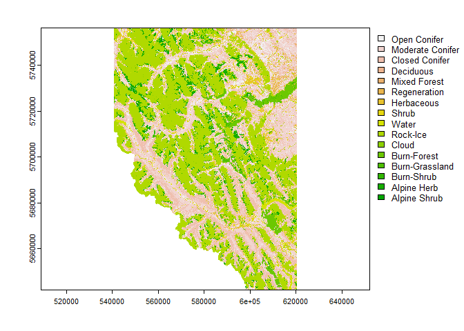<!-- -->

HABITATTYPE field was imported back in with the tif

Note the presence of clouds, rocks, ice, water - non vegetated
categories. This is why we call it landcover and not vegetation type.
Clouds in particular are a nuisance we will have to deal with later.

First, lets explore some graphing options to overlay some of our
previous wolf datasets over this landcover classification, and
experiment with changing the colors of the landcover categories.

``` r
wolfyht<-st_read("Data/wolfyht.shp")
```

    ## Reading layer `wolfyht' from data source 
    ##   `C:\Users\Administrator.KJLWS11\Documents\Lab4\Data\wolfyht.shp' 
    ##   using driver `ESRI Shapefile'
    ## Simple feature collection with 413 features and 21 fields
    ## Geometry type: POINT
    ## Dimension:     XY
    ## Bounding box:  xmin: 555853 ymin: 5656997 xmax: 605389 ymax: 5741316
    ## Projected CRS: NAD83 / UTM zone 11N

``` r
plot(landcover16, col=rainbow(16))
```

    ## Warning: [plot] unknown categories in raster values

``` r
plot(wolfyht, add=TRUE, type="p", color = "gray25", pch=19, cex = 0.75)
```

    ## Warning in plot.sf(wolfyht, add = TRUE, type = "p", color = "gray25", pch =
    ## 19, : ignoring all but the first attribute

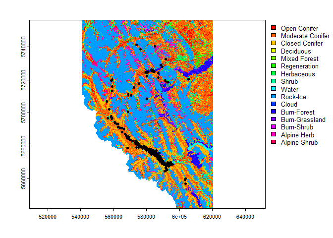<!-- -->

``` r
#blanking out mapview for creation of github document
#mapview(landcover16, zcol = "HABITATTYPE") + wolfyht 

#tmap option of interactive maps
#tmap_mode("view")
#landcover_map <- tm_shape(landcover16) + tm_raster()
#landcover_map + tm_shape(wolfyht) + tm_sf()
```

Note that this extent is different than below. But now, lets make a
second plot zooming into a specific area of the Red Deer pack showing
one way how to ‘clip’ the extent to a zoomed in area.

``` r
## lets make a second plot zooming into a specific area of the Red Deer pack
yht.raster <- rast()
ext(yht.raster) <- c(xmin=570000, xmax=600000, ymin=5720000, ymax=5740000)  
plot(landcover16, col=rainbow(16), ext=yht.raster)
plot(wolfyht, add=TRUE, type="p", color = "gray25", pch=19)
```

    ## Warning in plot.sf(wolfyht, add = TRUE, type = "p", color = "gray25", pch = 19):
    ## ignoring all but the first attribute

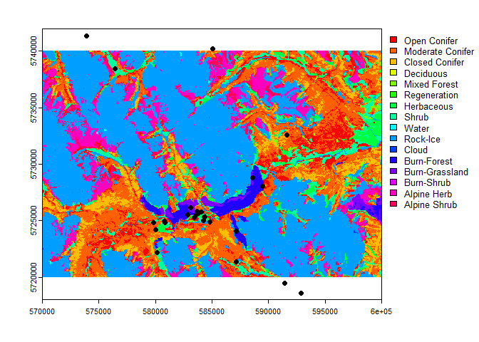<!-- -->

Next, IMAGINE we needed to resample the landcover16 model using the
nerest neighbor method to have the same raster extent as our ‘mask’.
This will take several minutes of system time. Note here we are
resampling to nearest neighbor to preserve the integer value - if you do
this using the bilinear resampling you get double format numbers (i.e.,
not integer values). Learn more about the format of resampling in
resample using:

    ?resample

which actually isn’t that helpful. A more helpful explanation and
demonstration of the difference between
[link](https://www.nceas.ucsb.edu/scicomp/usecases/resamplerasterimages)

Resampling Landcover.

``` r
landcover2<-resample(landcover16, mask.raster, method="ngb") 
extent(landcover2)
```

Now the landcovers would be the same across your mask.raster.

# Loading Wolf Data from Lab 3

``` r
wolfkde <- read.csv("Data/wolfkde5.csv")
table(wolfkde$used, wolfkde$pack)
```

    ##    
    ##     Bow Valley Red Deer
    ##   0       1000      996
    ##   1        320       93

``` r
summary(wolfkde)
```

    ##     deer_w2         moose_w2         elk_w2         sheep_w2    
    ##  Min.   :1.000   Min.   :1.000   Min.   :1.000   Min.   :1.000  
    ##  1st Qu.:3.000   1st Qu.:3.000   1st Qu.:3.000   1st Qu.:1.000  
    ##  Median :4.000   Median :4.000   Median :4.000   Median :3.000  
    ##  Mean   :3.384   Mean   :3.446   Mean   :3.394   Mean   :2.782  
    ##  3rd Qu.:4.000   3rd Qu.:5.000   3rd Qu.:4.000   3rd Qu.:4.000  
    ##  Max.   :7.000   Max.   :7.000   Max.   :7.000   Max.   :7.000  
    ##  NA's   :252     NA's   :252     NA's   :252     NA's   :252    
    ##     goat_w2         wolf_w2        Elevation2   DistFromHumanAccess2
    ##  Min.   :1.000   Min.   :1.000   Min.   :1401   Min.   :   0.0      
    ##  1st Qu.:1.000   1st Qu.:3.000   1st Qu.:1578   1st Qu.: 219.9      
    ##  Median :3.000   Median :4.000   Median :1931   Median : 607.7      
    ##  Mean   :2.827   Mean   :3.609   Mean   :1944   Mean   : 987.0      
    ##  3rd Qu.:4.000   3rd Qu.:4.000   3rd Qu.:2246   3rd Qu.:1418.3      
    ##  Max.   :7.000   Max.   :7.000   Max.   :3112   Max.   :6761.5      
    ##  NA's   :252     NA's   :252                    NA's   :39          
    ##  DistFromHighHumanAccess2  landcover16        EASTING          NORTHING      
    ##  Min.   :    0.0          Min.   : 1.000   Min.   :547357   Min.   :5656997  
    ##  1st Qu.:  266.7          1st Qu.: 2.000   1st Qu.:570226   1st Qu.:5676155  
    ##  Median : 1014.6          Median : 3.000   Median :580419   Median :5685650  
    ##  Mean   : 2560.4          Mean   : 5.666   Mean   :579268   Mean   :5695301  
    ##  3rd Qu.: 3224.2          3rd Qu.:10.000   3rd Qu.:588609   3rd Qu.:5716738  
    ##  Max.   :16194.7          Max.   :16.000   Max.   :611227   Max.   :5748276  
    ##  NA's   :39                                                                  
    ##      pack                used          usedFactor     habitatType       
    ##  Length:2409        Min.   :0.0000   Min.   :0.0000   Length:2409       
    ##  Class :character   1st Qu.:0.0000   1st Qu.:0.0000   Class :character  
    ##  Mode  :character   Median :0.0000   Median :0.0000   Mode  :character  
    ##                     Mean   :0.1714   Mean   :0.1714                     
    ##                     3rd Qu.:0.0000   3rd Qu.:0.0000                     
    ##                     Max.   :1.0000   Max.   :1.0000                     
    ##                                                                         
    ##   landcov.f          closedConif        modConif        openConif      
    ##  Length:2409        Min.   :0.0000   Min.   :0.0000   Min.   :0.00000  
    ##  Class :character   1st Qu.:0.0000   1st Qu.:0.0000   1st Qu.:0.00000  
    ##  Mode  :character   Median :0.0000   Median :0.0000   Median :0.00000  
    ##                     Mean   :0.2022   Mean   :0.3039   Mean   :0.05355  
    ##                     3rd Qu.:0.0000   3rd Qu.:1.0000   3rd Qu.:0.00000  
    ##                     Max.   :1.0000   Max.   :1.0000   Max.   :1.00000  
    ##                                                                        
    ##      decid              regen               mixed             herb        
    ##  Min.   :0.000000   Min.   :0.0000000   Min.   :0.0000   Min.   :0.00000  
    ##  1st Qu.:0.000000   1st Qu.:0.0000000   1st Qu.:0.0000   1st Qu.:0.00000  
    ##  Median :0.000000   Median :0.0000000   Median :0.0000   Median :0.00000  
    ##  Mean   :0.001245   Mean   :0.0008302   Mean   :0.0191   Mean   :0.02325  
    ##  3rd Qu.:0.000000   3rd Qu.:0.0000000   3rd Qu.:0.0000   3rd Qu.:0.00000  
    ##  Max.   :1.000000   Max.   :1.0000000   Max.   :1.0000   Max.   :1.00000  
    ##                                                                           
    ##      shrub             water             rockIce            burn        
    ##  Min.   :0.00000   Min.   :0.000000   Min.   :0.0000   Min.   :0.00000  
    ##  1st Qu.:0.00000   1st Qu.:0.000000   1st Qu.:0.0000   1st Qu.:0.00000  
    ##  Median :0.00000   Median :0.000000   Median :0.0000   Median :0.00000  
    ##  Mean   :0.05023   Mean   :0.008302   Mean   :0.2653   Mean   :0.03445  
    ##  3rd Qu.:0.00000   3rd Qu.:0.000000   3rd Qu.:1.0000   3rd Qu.:0.00000  
    ##  Max.   :1.00000   Max.   :1.000000   Max.   :1.0000   Max.   :1.00000  
    ##                                                                         
    ##    alpineHerb       alpineShrub          alpine       
    ##  Min.   :0.00000   Min.   :0.00000   Min.   :0.00000  
    ##  1st Qu.:0.00000   1st Qu.:0.00000   1st Qu.:0.00000  
    ##  Median :0.00000   Median :0.00000   Median :0.00000  
    ##  Mean   :0.02283   Mean   :0.01494   Mean   :0.03778  
    ##  3rd Qu.:0.00000   3rd Qu.:0.00000   3rd Qu.:0.00000  
    ##  Max.   :1.00000   Max.   :1.00000   Max.   :1.00000  
    ## 

``` r
#wolfkde <- na.omit(wolfkde)
#summary(wolfkde)
#table(wolfkde$used, wolfkde$pack)
```

Now we can make a single nice plot of the X and Y locations by Used by
Pack, where used locations are a bright blue, and available locations
are dark blue.

``` r
ggplot(wolfkde, aes(x=EASTING, y = NORTHING, color=usedFactor)) + geom_point() + stat_density2d() + facet_grid(pack ~ ., scales="free")
```

    ## Warning: The following aesthetics were dropped during statistical transformation: colour
    ## ℹ This can happen when ggplot fails to infer the correct grouping structure in
    ##   the data.
    ## ℹ Did you forget to specify a `group` aesthetic or to convert a numerical
    ##   variable into a factor?
    ## The following aesthetics were dropped during statistical transformation: colour
    ## ℹ This can happen when ggplot fails to infer the correct grouping structure in
    ##   the data.
    ## ℹ Did you forget to specify a `group` aesthetic or to convert a numerical
    ##   variable into a factor?

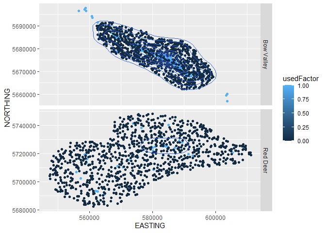<!-- -->

``` r
# or, Facetting by Used
ggplot(wolfkde, aes(x=EASTING, y = NORTHING)) + geom_point() + stat_density2d() + facet_grid(pack ~ usedFactor, scales="free")
```

    ## Warning: `stat_contour()`: Zero contours were generated

    ## Warning in min(x): no non-missing arguments to min; returning Inf

    ## Warning in max(x): no non-missing arguments to max; returning -Inf

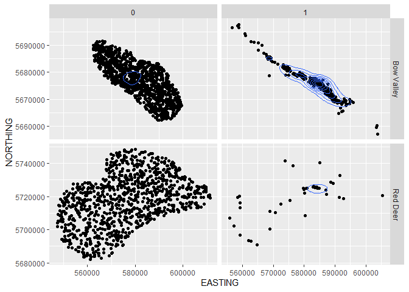<!-- -->

# Univariate Model-fitting

These are a repeat of the commands from lab 3, but here I will show you
how to extract covariate tables from multiple models. Note in the script
I also did this for Bv and rd wolf packs. We will just keep these handy
for later, as today’s focus is on categorical analysis of landcover.
But, it might be handy to relate certain landcover types with certain
prey (e.g., alpine and sheep/goats) for discussion.

``` r
### First for all packs
elev <- glm(used ~ Elevation2, family=binomial(logit), data=wolfkde)
distacc <- glm(used ~ DistFromHumanAccess2, family=binomial(logit), data=wolfkde)
disthha <- glm(used ~ DistFromHighHumanAccess2, family=binomial(logit), data=wolfkde)
sheep <- glm(used ~ sheep_w2, family=binomial(logit), data=wolfkde)
goat <- glm(used ~ goat_w2, family=binomial(logit), data=wolfkde)
elk <- glm(used ~ elk_w2, family=binomial(logit), data=wolfkde)
moose <- glm(used ~ moose_w2, family=binomial(logit), data=wolfkde)
deer <- glm(used ~ deer_w2, family=binomial(logit), data=wolfkde)
```

Creating tables of B, SE. First grab all of the estimates and standard
errors

``` r
models = rbind(summary(elev)$coefficients[,1:2], summary(disthha)$coefficients[,1:2], summary(distacc)$coefficients[,1:2], summary(sheep)$coefficients[,1:2], summary(goat)$coefficients[,1:2], summary(elk)$coefficients[,1:2], summary(moose)$coefficients[,1:2], summary(deer)$coefficients[,1:2])
# Name your models
modelnames = c("elev","disthha", "distacc", "sheep", "goat", "elk", "moose", "deer")
# Now put all of your estimates in a pretty table with names that you'll remember!
estimates.all = matrix(models, nrow=2*length(modelnames), ncol=2, dimnames = list(paste(rep(modelnames, each=2),c("intercept", "coefficient")), c("B", "SE")))
estimates.all
```

    ##                                 B           SE
    ## elev intercept       7.8662059284 4.888042e-01
    ## elev coefficient    -0.0054553009 3.038507e-04
    ## disthha intercept   -1.1458898955 6.659037e-02
    ## disthha coefficient -0.0002289669 2.828194e-05
    ## distacc intercept   -0.3794524945 8.182169e-02
    ## distacc coefficient -0.0021196593 1.626086e-04
    ## sheep intercept     -1.1316070095 1.057795e-01
    ## sheep coefficient   -0.1302709451 3.506634e-02
    ## goat intercept      -0.1146280770 1.022672e-01
    ## goat coefficient    -0.5815985563 4.367293e-02
    ## elk intercept       -5.8837628158 3.028361e-01
    ## elk coefficient      1.1221296007 6.991732e-02
    ## moose intercept     -3.1290933007 1.890911e-01
    ## moose coefficient    0.4409469384 4.503214e-02
    ## deer intercept      -5.9323405798 3.065830e-01
    ## deer coefficient     1.1179353895 6.934898e-02

``` r
plot(estimates.all)
```

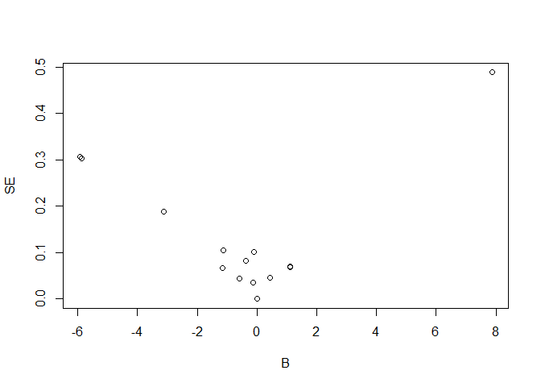<!-- -->

# Categorical Resource Selection

The first thing we need to do is add a column with the name habitat type
(landcover) in it to help us keep track of what the different landcover
codes mean.

``` r
levels(wolfkde$landcover16) ## see, all we have is landcover code
```

    ## NULL

``` r
wolfkde$habitatType = ifelse(wolfkde$landcover16 == 0, "NA", 
                            ifelse(wolfkde$landcover16 == 1, "Open Conifer", 
                            ifelse(wolfkde$landcover16 == 2, "Moderate Conifer", 
                            ifelse(wolfkde$landcover16 == 3, "Closed Conifer", 
                            ifelse(wolfkde$landcover16 == 4, "Deciduous", 
                            ifelse(wolfkde$landcover16 == 5, "Mixed", 
                            ifelse(wolfkde$landcover16 == 6, "Regen", 
                            ifelse(wolfkde$landcover16 == 7, "Herbaceous",                 
                            ifelse(wolfkde$landcover16 == 8, "Shrub",                       
                            ifelse(wolfkde$landcover16 == 9, "Water", 
                            ifelse(wolfkde$landcover16 == 10, "Rock-Ice", 
                            ifelse(wolfkde$landcover16 == 11, "Cloud", 
                            ifelse(wolfkde$landcover16 == 12, "Burn-Forest",               
                            ifelse(wolfkde$landcover16 == 13, "Burn-Grassland", 
                            ifelse(wolfkde$landcover16 == 14, "Burn-Shrub", 
                            ifelse(wolfkde$landcover16 == 15, "Alpine Herb", "Alpine Shrub"))))))))))))))))

table(wolfkde$landcover16, wolfkde$used)
```

    ##     
    ##        0   1
    ##   1   92  37
    ##   2  557 175
    ##   3  429  58
    ##   4    3   0
    ##   5   17  29
    ##   6    2   0
    ##   7   35  21
    ##   8   87  34
    ##   9    8  12
    ##   10 629  10
    ##   12  39  30
    ##   13   8   5
    ##   14   1   0
    ##   15  55   0
    ##   16  34   2

Note: that each of you *may* get slightly different AVAILABILITIES
(especially if we did not set.seed(11) because of your own random
sampling of availability. This is particularly problematic for rare
landcover types like 4 (decid), 6 (regen), clouds (11), etc. Thus for
some of you, your table may look slightly different and you will have to
keep track of landcover types yourself.

Alternatively, redo the analyses from Lab 3 with the set.seed(11) code
in the Lab2NeededforLab4.R code that I have now updated.

Lets this graph shows the differences in the proportions between used
and available for both packs for landcover type

``` r
table(wolfkde$habitatType, wolfkde$usedFactor)
```

    ##                   
    ##                      0   1
    ##   Alpine Herb       55   0
    ##   Alpine Shrub      34   2
    ##   Burn-Forest       39  30
    ##   Burn-Grassland     8   5
    ##   Burn-Shrub         1   0
    ##   Closed Conifer   429  58
    ##   Deciduous          3   0
    ##   Herbaceous        35  21
    ##   Mixed             17  29
    ##   Moderate Conifer 557 175
    ##   Open Conifer      92  37
    ##   Regen              2   0
    ##   Rock-Ice         629  10
    ##   Shrub             87  34
    ##   Water              8  12

``` r
ggplot(wolfkde, aes(x=landcover16, y=..density.., fill = used)) +geom_histogram(binwidth = 1) + facet_grid(used~.)
```

    ## Warning: The dot-dot notation (`..density..`) was deprecated in ggplot2 3.4.0.
    ## ℹ Please use `after_stat(density)` instead.

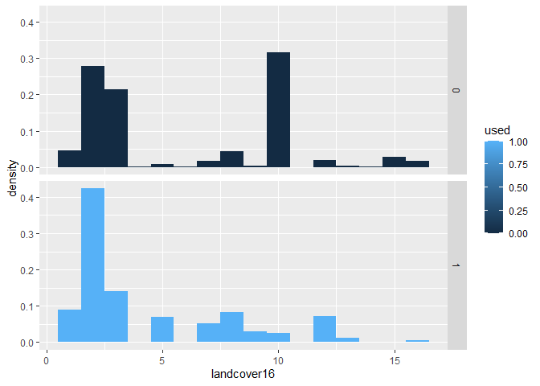<!-- -->

What should we do about the NA or Clouds? We will have to discuss what
to do with NA’s and Cloud? For now, we will decide to remove clouds as
missing data

``` r
wolfkde2 <- wolfkde[wolfkde$landcover16 != 11, ]
wolfkde3 <-wolfkde2[wolfkde2$landcover16 != 0, ]
table(wolfkde3$habitatType, wolfkde3$usedFactor)
```

    ##                   
    ##                      0   1
    ##   Alpine Herb       55   0
    ##   Alpine Shrub      34   2
    ##   Burn-Forest       39  30
    ##   Burn-Grassland     8   5
    ##   Burn-Shrub         1   0
    ##   Closed Conifer   429  58
    ##   Deciduous          3   0
    ##   Herbaceous        35  21
    ##   Mixed             17  29
    ##   Moderate Conifer 557 175
    ##   Open Conifer      92  37
    ##   Regen              2   0
    ##   Rock-Ice         629  10
    ##   Shrub             87  34
    ##   Water              8  12

See, we have removed clouds and NA’s

Next we will create a ‘legend’ file (names.m) to help us keep track of
contrasts

``` r
names.m = data.frame(unique(wolfkde3$landcover16),unique(wolfkde3$habitatType))
# Now I put it order
names.m = names.m[order(names.m)[1:15],]
```

    ## Warning in xtfrm.data.frame(x): cannot xtfrm data frames

``` r
names.m
```

    ##    unique.wolfkde3.landcover16. unique.wolfkde3.habitatType.
    ## 4                             1                 Open Conifer
    ## 2                             2             Moderate Conifer
    ## 7                             3               Closed Conifer
    ## 15                            4                    Deciduous
    ## 10                            5                        Mixed
    ## 13                            6                        Regen
    ## 5                             7                   Herbaceous
    ## 1                             8                        Shrub
    ## 11                            9                        Water
    ## 8                            10                     Rock-Ice
    ## 9                            12                  Burn-Forest
    ## 3                            13               Burn-Grassland
    ## 14                           14                   Burn-Shrub
    ## 12                           15                  Alpine Herb
    ## 6                            16                 Alpine Shrub

Define a factor variable, landcov.f, \# the sorted table makes defining
the names of your factor level easy!

``` r
wolfkde3$landcov.f = factor(wolfkde3$landcover16,labels = names.m$unique.wolfkde3.habitatType)
```

Note that there are many alternative ways of defining your
landcover/habitattype as a factor. This method seemed most explicit in
terms of defining the design matrix for landcover categories.

``` r
table(wolfkde3$landcov.f, wolfkde3$usedFactor)
```

    ##                   
    ##                      0   1
    ##   Open Conifer      92  37
    ##   Moderate Conifer 557 175
    ##   Closed Conifer   429  58
    ##   Deciduous          3   0
    ##   Mixed             17  29
    ##   Regen              2   0
    ##   Herbaceous        35  21
    ##   Shrub             87  34
    ##   Water              8  12
    ##   Rock-Ice         629  10
    ##   Burn-Forest       39  30
    ##   Burn-Grassland     8   5
    ##   Burn-Shrub         1   0
    ##   Alpine Herb       55   0
    ##   Alpine Shrub      34   2

``` r
table(wolfkde3$landcov.f, wolfkde3$landcover16)
```

    ##                   
    ##                      1   2   3   4   5   6   7   8   9  10  12  13  14  15  16
    ##   Open Conifer     129   0   0   0   0   0   0   0   0   0   0   0   0   0   0
    ##   Moderate Conifer   0 732   0   0   0   0   0   0   0   0   0   0   0   0   0
    ##   Closed Conifer     0   0 487   0   0   0   0   0   0   0   0   0   0   0   0
    ##   Deciduous          0   0   0   3   0   0   0   0   0   0   0   0   0   0   0
    ##   Mixed              0   0   0   0  46   0   0   0   0   0   0   0   0   0   0
    ##   Regen              0   0   0   0   0   2   0   0   0   0   0   0   0   0   0
    ##   Herbaceous         0   0   0   0   0   0  56   0   0   0   0   0   0   0   0
    ##   Shrub              0   0   0   0   0   0   0 121   0   0   0   0   0   0   0
    ##   Water              0   0   0   0   0   0   0   0  20   0   0   0   0   0   0
    ##   Rock-Ice           0   0   0   0   0   0   0   0   0 639   0   0   0   0   0
    ##   Burn-Forest        0   0   0   0   0   0   0   0   0   0  69   0   0   0   0
    ##   Burn-Grassland     0   0   0   0   0   0   0   0   0   0   0  13   0   0   0
    ##   Burn-Shrub         0   0   0   0   0   0   0   0   0   0   0   0   1   0   0
    ##   Alpine Herb        0   0   0   0   0   0   0   0   0   0   0   0   0  55   0
    ##   Alpine Shrub       0   0   0   0   0   0   0   0   0   0   0   0   0   0  36

# Univariate Selection Ratio’s

First we will estimate Manly’s selection ratio by comparing the ratio of
used and available locations to each other, and taking the natural
logarithm of those in R. Manly et al. (2002) Chapter 1 Readings provide
an overview and methodology for this kind of design, relying on the
calculation of selection ratios:

$$\omega_i = \frac {\upsilon_i}{\alpha_i}$$ where $\upsilon_i$ is the
proportion of use of the habitat class **i** and $\alpha_i$ is the
proportion of availability of this habitat class **i**. Here, there are
1… **j** habitat categories.

Note that these ratios may be scaled so that their sum is equal to 1,
that is: $$\beta_i = \frac{\omega_i}{\sum_{i=1}^j \omega_j}$$ where
$\beta_j$ is said to be the Scaled Selectivity Coefficient for habitat
class **i**. This has the interpretation of being the estimated
probability that a category **i** resource unit would be selected if
each category from 1… **j** was equally available.

Note that it is customary to take the natural logarithmic transformation
of the $\omega_i$ to make the selectivity index symmetric for the same
amount of increase or decrease of use or availability. This is a similar
property in population ecology to the difference between lambda, the
ratio of two population sizes which estimates the absolute growth rate,
to little r, or intrinsic population growth rate, which measures the
relative growth rate. So we have
$$\ln(\omega_j) = ln(\frac {\upsilon_j}{\alpha_j})$$ This is often
referred to as the ln of the selection ratio, or Manly’s Selection
index.

We will now calculate selectivity statistics, both untransformed (which
we can call the selection ratio) and ln-transformed selectivity index
using our data frame of the availability and use by wolves for our \~ 16
‘landcover’ types in Banff National Park. To do this, we have to use the
random points and used points to represent the proportional use
$\upsilon_j$and availability $\alpha_i$components of the equations
above, respectively.

``` r
table(wolfkde3$habitatType, wolfkde3$usedFactor)
```

    ##                   
    ##                      0   1
    ##   Alpine Herb       55   0
    ##   Alpine Shrub      34   2
    ##   Burn-Forest       39  30
    ##   Burn-Grassland     8   5
    ##   Burn-Shrub         1   0
    ##   Closed Conifer   429  58
    ##   Deciduous          3   0
    ##   Herbaceous        35  21
    ##   Mixed             17  29
    ##   Moderate Conifer 557 175
    ##   Open Conifer      92  37
    ##   Regen              2   0
    ##   Rock-Ice         629  10
    ##   Shrub             87  34
    ##   Water              8  12

## Estimating Proportions

Next we will create a dataframe from this table, and start estimating
the components of selectivity from the equations above, availability and
use proportions, selectivity, etc.

``` r
landcovSelection <- table(wolfkde3$habitatType, wolfkde3$usedFactor)
landcovSelection2 <- as.data.frame.matrix(landcovSelection)
colnames(landcovSelection2)[1:2] <- c("avail","used")
## Calculate Proportional Availability
sum(landcovSelection2$used)
```

    ## [1] 413

``` r
landcovSelection2$pUse <- landcovSelection2$used /413
sum(landcovSelection2$avail)
```

    ## [1] 1996

``` r
landcovSelection2$pAvail <- landcovSelection2$avail /1996 # note 2000 because of censored cloud and NA's. 
landcovSelection2
```

    ##                  avail used        pUse      pAvail
    ## Alpine Herb         55    0 0.000000000 0.027555110
    ## Alpine Shrub        34    2 0.004842615 0.017034068
    ## Burn-Forest         39   30 0.072639225 0.019539078
    ## Burn-Grassland       8    5 0.012106538 0.004008016
    ## Burn-Shrub           1    0 0.000000000 0.000501002
    ## Closed Conifer     429   58 0.140435835 0.214929860
    ## Deciduous            3    0 0.000000000 0.001503006
    ## Herbaceous          35   21 0.050847458 0.017535070
    ## Mixed               17   29 0.070217918 0.008517034
    ## Moderate Conifer   557  175 0.423728814 0.279058116
    ## Open Conifer        92   37 0.089588378 0.046092184
    ## Regen                2    0 0.000000000 0.001002004
    ## Rock-Ice           629   10 0.024213075 0.315130261
    ## Shrub               87   34 0.082324455 0.043587174
    ## Water                8   12 0.029055690 0.004008016

## Calculating Selectivity

Now, lets calculate the selection ratio using the proportions of use and
availability

``` r
landcovSelection2$selection <- landcovSelection2$pUse / landcovSelection2$pAvail
plot(landcovSelection2$selection)
```

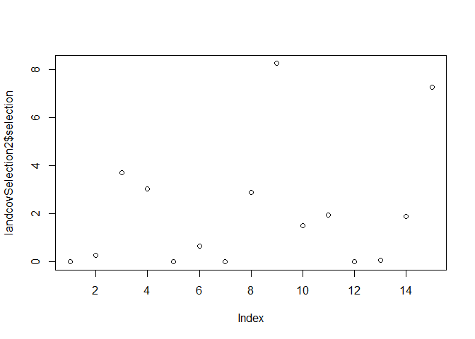<!-- -->

Next, lets compare the calculation of selection ratio from just the \#
of locations (incorrect). This is incorrect because the \# of used and
available locations are different, and thus, the ratio’s are not
equivalent to selection. For datasets where the \# of used and available
location totals are the same, this simple approach of skipping the
estimation of the proportion of use or availability WILL work.

``` r
landcovSelection2$selectionN <- landcovSelection2$used / landcovSelection2$avail
plot(landcovSelection2$selection, landcovSelection2$selectionN)
```

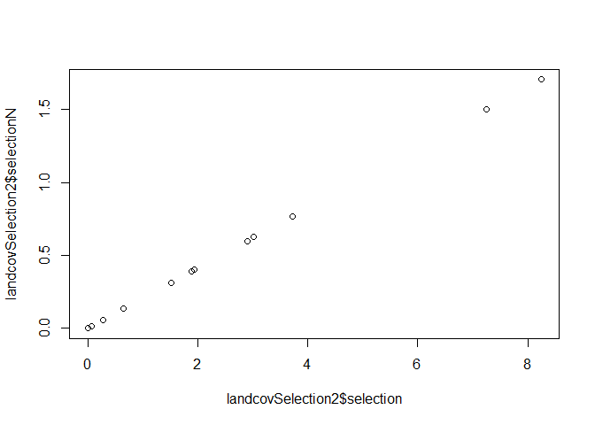<!-- --> Compare the
two - they are absolutely LINEARLY related, but, only the ratio of the
proportions of use and availability, pUse/pAvail is interpretable as a
selection ratio about 1.0.

Next, lets take a look, this is the selection ratio, the ratio of the
proportion used to the prortion available from our first equation above.

``` r
landcovSelection2
```

    ##                  avail used        pUse      pAvail  selection selectionN
    ## Alpine Herb         55    0 0.000000000 0.027555110 0.00000000 0.00000000
    ## Alpine Shrub        34    2 0.004842615 0.017034068 0.28428999 0.05882353
    ## Burn-Forest         39   30 0.072639225 0.019539078 3.71763829 0.76923077
    ## Burn-Grassland       8    5 0.012106538 0.004008016 3.02058111 0.62500000
    ## Burn-Shrub           1    0 0.000000000 0.000501002 0.00000000 0.00000000
    ## Closed Conifer     429   58 0.140435835 0.214929860 0.65340309 0.13519814
    ## Deciduous            3    0 0.000000000 0.001503006 0.00000000 0.00000000
    ## Herbaceous          35   21 0.050847458 0.017535070 2.89975787 0.60000000
    ## Mixed               17   29 0.070217918 0.008517034 8.24440963 1.70588235
    ## Moderate Conifer   557  175 0.423728814 0.279058116 1.51842498 0.31418312
    ## Open Conifer        92   37 0.089588378 0.046092184 1.94367828 0.40217391
    ## Regen                2    0 0.000000000 0.001002004 0.00000000 0.00000000
    ## Rock-Ice           629   10 0.024213075 0.315130261 0.07683513 0.01589825
    ## Shrub               87   34 0.082324455 0.043587174 1.88873118 0.39080460
    ## Water                8   12 0.029055690 0.004008016 7.24939467 1.50000000

## Selectivity Coefficient, the Ln-Selection Ratio

Next we take the natural logarithm, ln() which in R is represented by
log()

``` r
landcovSelection2$lnSelection <- log(landcovSelection2$selection)

## Lets make a new column of habitatType
landcovSelection2$landcoverType <- c("Alpine Herb", "Alpine Shrub", "Burn-Forest", "Burn-Grassland", "Burn-Shrub", "Closed Conifer", "Deciduous", "Herbaceous", "Mixed", "Moderate Conifer" ,"Open Conifer", "Regen", "Rock-Ice", "Shrub", "Water")
                          

## lets make a plot of the Manly (ln) Selectivity Coefficients
ggplot(data=landcovSelection2, aes(x=landcoverType, y = lnSelection)) + geom_point(size=4) + theme(axis.text.x = element_text(angle = 90))
```

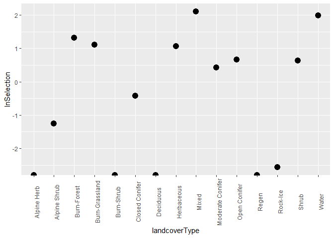<!-- -->

This is a simple histogram of the Manly’s ln-transformed selectivity
coefficients as a function of landcover types.

``` r
## it might be handy to save this
write.table(landcovSelection2, "Data/wolfselection.csv", sep=",", row.names = TRUE, col.names=TRUE)
#str(landcovSelection2)
```

How do the selection ratio and Selectivity coefficient relate to each
other??? Lets make ggplots of the Selectivity and Ln Selectivity
Coefficients

``` r
## Selection ratio
ggplot(landcovSelection2, aes(x=landcoverType, y = selection)) + geom_bar(stat="Identity") + theme(axis.text.x = element_text(angle = 90))
```

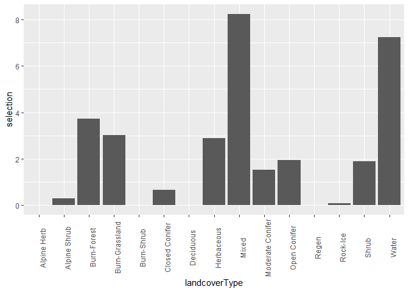<!-- -->

``` r
## Ln-Selection Ratio
ggplot(landcovSelection2, aes(x=landcoverType, y = lnSelection)) + 
geom_bar(stat="Identity") + theme(axis.text.x = element_text(angle = 90))
```

    ## Warning: Removed 4 rows containing missing values (`geom_bar()`).

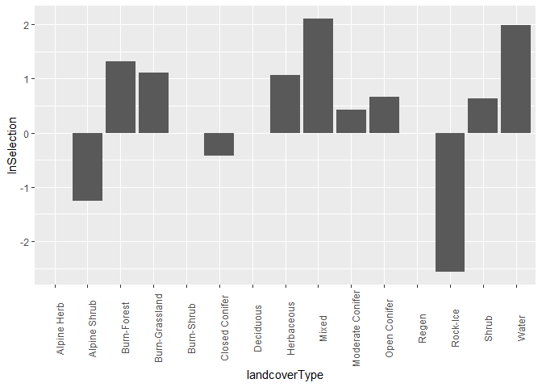<!-- -->

What is the relationship between the selection ratio and the
Ln-Selection Ratio?

``` r
## Fancier ggplot
ggplot(landcovSelection2, aes(x=selection, y = lnSelection)) + stat_smooth()
```

    ## `geom_smooth()` using method = 'loess' and formula = 'y ~ x'

    ## Warning: Removed 4 rows containing non-finite values (`stat_smooth()`).

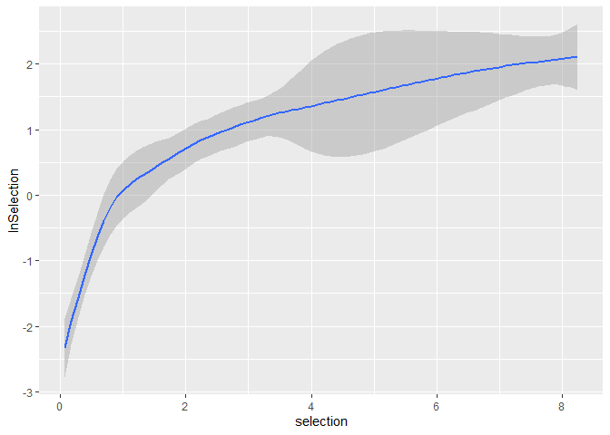<!-- -->
**Discussion** why is the relationship between the selection ratio and
the Ln selection ration curvilinear like this?

# Selection Ratio’s in adehabitatHS

Next, we will use the adehabitat package functions to estimate selection
ratio’s for proportional availability and use data following Manly et
al. 2003. We will use the example of Elk (Manly et al., 2003, p.62).
This is a classic study based on the original work of my predecessor
here at the University of Montana, C.Les Marcum, and worth a moment to
reflect on.

This is amongst the first statistical test for whether or not habitat
selection occurs in animals. This method assumes: (i) independence
between animals, and (ii) all animals are selecting habitat in the same
way. Moreover, the overall hypothesis tested is that the use of resource
categories differs from random availability, thats it. Since the 1980’s
we have learned that this is often not a very interesting hypothesis to
test, since we know it true that animals almost always use resources in
a selective way, nonetheless, this is where the field started.

**References** Marcum, C.L. & Loftsgaarden, D.O. (1980) A nonmapping
technique for studying habitat preferences. Journal of Wildlife
Management, 44, 963-968.

This shows examples with the older adehabitat package, note these are
now part of adehabitatHS [adehabitat
package](https://rdrr.io/cran/adehabitat/man/wi.html) [adehabitatHS
vignette/demo](http://www2.uaem.mx/r-mirror/web/packages/adehabitatHS/vignettes/adehabitatHS.pdf)

``` r
## Estimated available proportions on design I data
elk.avail <- c(15, 61, 84, 40)
elk.used <- c(3, 90, 181, 51)
names(elk.used) <- c("0%", "1-25%", "26-75%", ">75%")
names(elk.avail) <- names(elk.used)
## Computation of wi
(wiRatio <- widesI(elk.used, elk.avail, avknown=FALSE))
```

    ## 
    ## 
    ## ************** Manly's Selection ratios for design I ********
    ## 
    ## Significance of habitat selection:
    ##        Khi2L           df       pvalue 
    ## 2.196498e+01 3.000000e+00 6.633481e-05 
    ## 
    ## 
    ## Table of ratios (p-values should be
    ##  compared with Bonferroni level= 0.0125 )
    ##         used avail    Wi SE.Wi     P    Bi
    ## 0%     0.009 0.075 0.123 0.077 0.000 0.039
    ## 1-25%  0.277 0.305 0.908 0.127 0.467 0.289
    ## 26-75% 0.557 0.420 1.326 0.128 0.011 0.422
    ## >75%   0.157 0.200 0.785 0.150 0.151 0.250
    ## 
    ## 
    ## Bonferroni classement 
    ## Based on 95 % confidence intervals on the differences of Wi :
    ##                                  
    ## habitat  26-75%  1-25%  >75%  0% 
    ## 26-75%  ---------------------    
    ## 1-25%   ---------------------    
    ## >75%    ---------------------    
    ## 0%                           ----

``` r
## plot the values of the selection ratios
plot(wiRatio)
```

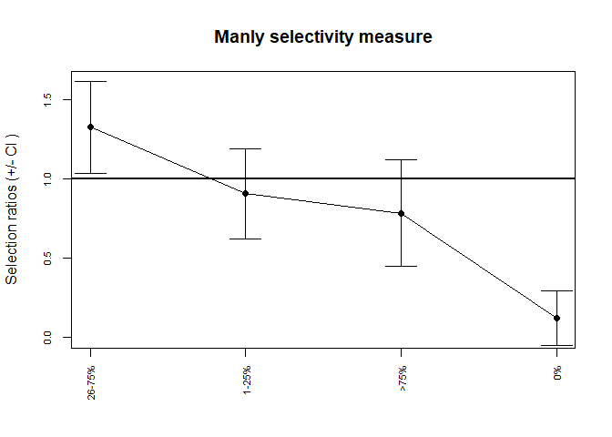<!-- -->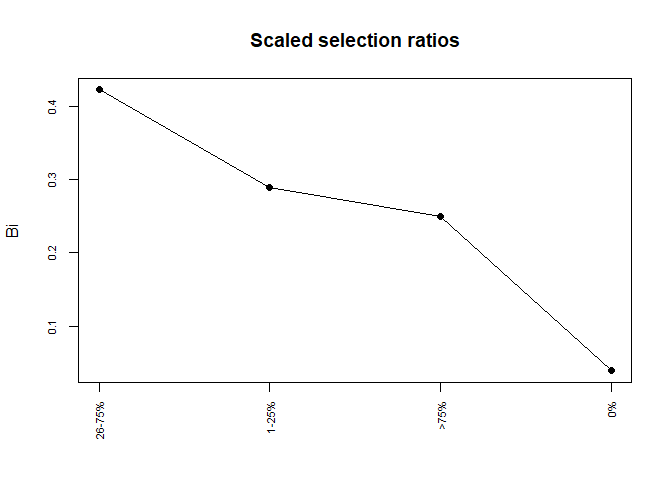<!-- -->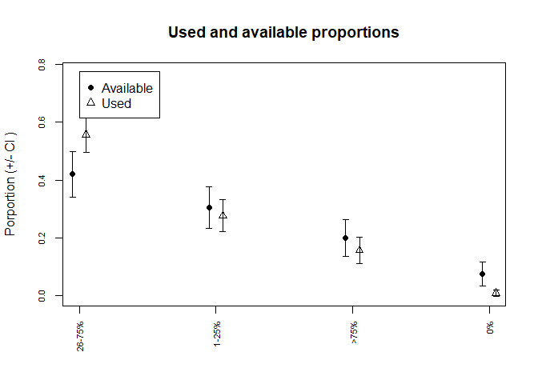<!-- -->

# Categorical Logistic Regression

Lastly, we will learn about analyzing categorical variables using a new
approach compared to categories. To learn more about how R uses
contrasts to set the design matrix in any linear model search for help
on contrast matrices

    ?contrast

Even though this may seem ‘new’ if you have ever done ANOVA (a linear
model) in R, you have used contrast matrices to do so.

``` r
contrasts(wolfkde3$landcov.f) = contr.treatment(15) 
### To see the design matrix assigned
attributes(wolfkde3$landcov.f)
```

    ## $levels
    ##  [1] "Open Conifer"     "Moderate Conifer" "Closed Conifer"   "Deciduous"       
    ##  [5] "Mixed"            "Regen"            "Herbaceous"       "Shrub"           
    ##  [9] "Water"            "Rock-Ice"         "Burn-Forest"      "Burn-Grassland"  
    ## [13] "Burn-Shrub"       "Alpine Herb"      "Alpine Shrub"    
    ## 
    ## $class
    ## [1] "factor"
    ## 
    ## $contrasts
    ##                  2 3 4 5 6 7 8 9 10 11 12 13 14 15
    ## Open Conifer     0 0 0 0 0 0 0 0  0  0  0  0  0  0
    ## Moderate Conifer 1 0 0 0 0 0 0 0  0  0  0  0  0  0
    ## Closed Conifer   0 1 0 0 0 0 0 0  0  0  0  0  0  0
    ## Deciduous        0 0 1 0 0 0 0 0  0  0  0  0  0  0
    ## Mixed            0 0 0 1 0 0 0 0  0  0  0  0  0  0
    ## Regen            0 0 0 0 1 0 0 0  0  0  0  0  0  0
    ## Herbaceous       0 0 0 0 0 1 0 0  0  0  0  0  0  0
    ## Shrub            0 0 0 0 0 0 1 0  0  0  0  0  0  0
    ## Water            0 0 0 0 0 0 0 1  0  0  0  0  0  0
    ## Rock-Ice         0 0 0 0 0 0 0 0  1  0  0  0  0  0
    ## Burn-Forest      0 0 0 0 0 0 0 0  0  1  0  0  0  0
    ## Burn-Grassland   0 0 0 0 0 0 0 0  0  0  1  0  0  0
    ## Burn-Shrub       0 0 0 0 0 0 0 0  0  0  0  1  0  0
    ## Alpine Herb      0 0 0 0 0 0 0 0  0  0  0  0  1  0
    ## Alpine Shrub     0 0 0 0 0 0 0 0  0  0  0  0  0  1

``` r
levels(wolfkde3$landcov.f)
```

    ##  [1] "Open Conifer"     "Moderate Conifer" "Closed Conifer"   "Deciduous"       
    ##  [5] "Mixed"            "Regen"            "Herbaceous"       "Shrub"           
    ##  [9] "Water"            "Rock-Ice"         "Burn-Forest"      "Burn-Grassland"  
    ## [13] "Burn-Shrub"       "Alpine Herb"      "Alpine Shrub"

Note that while we have cleaned up the clouds and NA’s, what should we
do about Burned-Grassland, Burned-Herbaceous and Burn-Forests? Recall
that these 3 landcover types had some categories with 0 observed wolf
uses in them, so we could combine them, lumping them and reclassify them
all as ‘burned’. We will return to this in a minute. Here, checking
above, we see that 11, 12, and 13 are all burns.

``` r
levels(wolfkde3$landcov.f)[11:13] = "Burn"
## note this then reduces us from 15 to 13 categories
contrasts(wolfkde3$landcov.f) = contr.treatment(13)
attributes(wolfkde3$landcov.f)
```

    ## $levels
    ##  [1] "Open Conifer"     "Moderate Conifer" "Closed Conifer"   "Deciduous"       
    ##  [5] "Mixed"            "Regen"            "Herbaceous"       "Shrub"           
    ##  [9] "Water"            "Rock-Ice"         "Burn"             "Alpine Herb"     
    ## [13] "Alpine Shrub"    
    ## 
    ## $class
    ## [1] "factor"
    ## 
    ## $contrasts
    ##                  2 3 4 5 6 7 8 9 10 11 12 13
    ## Open Conifer     0 0 0 0 0 0 0 0  0  0  0  0
    ## Moderate Conifer 1 0 0 0 0 0 0 0  0  0  0  0
    ## Closed Conifer   0 1 0 0 0 0 0 0  0  0  0  0
    ## Deciduous        0 0 1 0 0 0 0 0  0  0  0  0
    ## Mixed            0 0 0 1 0 0 0 0  0  0  0  0
    ## Regen            0 0 0 0 1 0 0 0  0  0  0  0
    ## Herbaceous       0 0 0 0 0 1 0 0  0  0  0  0
    ## Shrub            0 0 0 0 0 0 1 0  0  0  0  0
    ## Water            0 0 0 0 0 0 0 1  0  0  0  0
    ## Rock-Ice         0 0 0 0 0 0 0 0  1  0  0  0
    ## Burn             0 0 0 0 0 0 0 0  0  1  0  0
    ## Alpine Herb      0 0 0 0 0 0 0 0  0  0  1  0
    ## Alpine Shrub     0 0 0 0 0 0 0 0  0  0  0  1

Note how the design matrix has collapsed burn into one category? What
other categories should we consider? Perhaps Alpine?

## Incorrectly Treating Landcover as Continuous

First, we will use Logistic regression incorrectly analyzing treating
landcover16 as a continuous covariate

``` r
naive.nf = glm(used~landcover16,data=wolfkde3, family=binomial(logit))
summary(naive.nf)
```

    ## 
    ## Call:
    ## glm(formula = used ~ landcover16, family = binomial(logit), data = wolfkde3)
    ## 
    ## Deviance Residuals: 
    ##     Min       1Q   Median       3Q      Max  
    ## -0.7438  -0.7101  -0.5324  -0.4822   2.3622  
    ## 
    ## Coefficients:
    ##             Estimate Std. Error z value Pr(>|z|)    
    ## (Intercept) -1.03803    0.08729  -11.89  < 2e-16 ***
    ## landcover16 -0.10554    0.01497   -7.05 1.79e-12 ***
    ## ---
    ## Signif. codes:  0 '***' 0.001 '**' 0.01 '*' 0.05 '.' 0.1 ' ' 1
    ## 
    ## (Dispersion parameter for binomial family taken to be 1)
    ## 
    ##     Null deviance: 2207.4  on 2408  degrees of freedom
    ## Residual deviance: 2152.0  on 2407  degrees of freedom
    ## AIC: 2156
    ## 
    ## Number of Fisher Scoring iterations: 4

We have incorrectly treated landcover code (1 to 16) as a continuous
covariate! We will analyze it correctly specifying in R that it is
actually a categorical variable using the I\~(landcover.f) Interaction
expansion. But first, to see how this works, we will do it JUST for one
landcover type, in this case, Open Conifer.

``` r
oc = glm(used~I(landcov.f=="Open Conifer"),data=wolfkde3, family = binomial(logit))
summary(oc)
```

    ## 
    ## Call:
    ## glm(formula = used ~ I(landcov.f == "Open Conifer"), family = binomial(logit), 
    ##     data = wolfkde3)
    ## 
    ## Deviance Residuals: 
    ##     Min       1Q   Median       3Q      Max  
    ## -0.8222  -0.6004  -0.6004  -0.6004   1.8986  
    ## 
    ## Coefficients:
    ##                                    Estimate Std. Error z value Pr(>|z|)    
    ## (Intercept)                        -1.62212    0.05643 -28.744  < 2e-16 ***
    ## I(landcov.f == "Open Conifer")TRUE  0.71125    0.20269   3.509  0.00045 ***
    ## ---
    ## Signif. codes:  0 '***' 0.001 '**' 0.01 '*' 0.05 '.' 0.1 ' ' 1
    ## 
    ## (Dispersion parameter for binomial family taken to be 1)
    ## 
    ##     Null deviance: 2207.4  on 2408  degrees of freedom
    ## Residual deviance: 2196.2  on 2407  degrees of freedom
    ## AIC: 2200.2
    ## 
    ## Number of Fisher Scoring iterations: 4

``` r
#str(summary(oc))
```

Now lets manually evaluate the predicted probability of a wolf used
location occuring in Open Conifer

``` r
exp(-1.622+0.711*1)/(1+exp(-1.622+0.711*1))
```

    ## [1] 0.2867952

``` r
## now compare to the probability of wolf use in non-conifer landcovers ?
exp(-1.622+0.711*0)/(1+exp(-1.622+0.711*0))
```

    ## [1] 0.1649292

Discussion: How do these probabilities of use in open conifer, and of
non-use of open conifer compare to our previous ratio’s of used to
available from the Manly selection ratio’s?

``` r
landcovSelection2
```

    ##                  avail used        pUse      pAvail  selection selectionN
    ## Alpine Herb         55    0 0.000000000 0.027555110 0.00000000 0.00000000
    ## Alpine Shrub        34    2 0.004842615 0.017034068 0.28428999 0.05882353
    ## Burn-Forest         39   30 0.072639225 0.019539078 3.71763829 0.76923077
    ## Burn-Grassland       8    5 0.012106538 0.004008016 3.02058111 0.62500000
    ## Burn-Shrub           1    0 0.000000000 0.000501002 0.00000000 0.00000000
    ## Closed Conifer     429   58 0.140435835 0.214929860 0.65340309 0.13519814
    ## Deciduous            3    0 0.000000000 0.001503006 0.00000000 0.00000000
    ## Herbaceous          35   21 0.050847458 0.017535070 2.89975787 0.60000000
    ## Mixed               17   29 0.070217918 0.008517034 8.24440963 1.70588235
    ## Moderate Conifer   557  175 0.423728814 0.279058116 1.51842498 0.31418312
    ## Open Conifer        92   37 0.089588378 0.046092184 1.94367828 0.40217391
    ## Regen                2    0 0.000000000 0.001002004 0.00000000 0.00000000
    ## Rock-Ice           629   10 0.024213075 0.315130261 0.07683513 0.01589825
    ## Shrub               87   34 0.082324455 0.043587174 1.88873118 0.39080460
    ## Water                8   12 0.029055690 0.004008016 7.24939467 1.50000000
    ##                  lnSelection    landcoverType
    ## Alpine Herb             -Inf      Alpine Herb
    ## Alpine Shrub      -1.2577605     Alpine Shrub
    ## Burn-Forest        1.3130886      Burn-Forest
    ## Burn-Grassland     1.1054492   Burn-Grassland
    ## Burn-Shrub              -Inf       Burn-Shrub
    ## Closed Conifer    -0.4255610   Closed Conifer
    ## Deciduous               -Inf        Deciduous
    ## Herbaceous         1.0646272       Herbaceous
    ## Mixed              2.1095353            Mixed
    ## Moderate Conifer   0.4176736 Moderate Conifer
    ## Open Conifer       0.6645822     Open Conifer
    ## Regen                   -Inf            Regen
    ## Rock-Ice          -2.5660933         Rock-Ice
    ## Shrub              0.6359053            Shrub
    ## Water              1.9809180            Water

# Multiple Logistic Regression with Multiple Categories

Next we will fit a model with 2 landcover types, manually, and then,
three, and so on until we fit all landcover types using the interaction
expansion with the contrast matrix.

``` r
## with just open conifer and burns
ocb = glm(used~I(landcov.f=="Open Conifer")+I(landcov.f=="Burn"), data = wolfkde3, family = binomial(logit))
summary(ocb)
```

    ## 
    ## Call:
    ## glm(formula = used ~ I(landcov.f == "Open Conifer") + I(landcov.f == 
    ##     "Burn"), family = binomial(logit), data = wolfkde3)
    ## 
    ## Deviance Residuals: 
    ##     Min       1Q   Median       3Q      Max  
    ## -1.0466  -0.5808  -0.5808  -0.5808   1.9303  
    ## 
    ## Coefficients:
    ##                                    Estimate Std. Error z value Pr(>|z|)    
    ## (Intercept)                        -1.69430    0.05892 -28.757  < 2e-16 ***
    ## I(landcov.f == "Open Conifer")TRUE  0.78343    0.20339   3.852 0.000117 ***
    ## I(landcov.f == "Burn")TRUE          1.37844    0.22995   5.995 2.04e-09 ***
    ## ---
    ## Signif. codes:  0 '***' 0.001 '**' 0.01 '*' 0.05 '.' 0.1 ' ' 1
    ## 
    ## (Dispersion parameter for binomial family taken to be 1)
    ## 
    ##     Null deviance: 2207.4  on 2408  degrees of freedom
    ## Residual deviance: 2164.3  on 2406  degrees of freedom
    ## AIC: 2170.3
    ## 
    ## Number of Fisher Scoring iterations: 4

``` r
### and with a few more variables
conif = glm(used~I(landcov.f=="Open Conifer")+I(landcov.f=="Moderate Conifer")
                  +I(landcov.f=="Closed Conifer"), data = wolfkde3, family = binomial(logit))
summary(conif)
```

    ## 
    ## Call:
    ## glm(formula = used ~ I(landcov.f == "Open Conifer") + I(landcov.f == 
    ##     "Moderate Conifer") + I(landcov.f == "Closed Conifer"), family = binomial(logit), 
    ##     data = wolfkde3)
    ## 
    ## Deviance Residuals: 
    ##     Min       1Q   Median       3Q      Max  
    ## -0.8222  -0.7392  -0.5381  -0.5036   2.0629  
    ## 
    ## Coefficients:
    ##                                        Estimate Std. Error z value Pr(>|z|)    
    ## (Intercept)                             -1.8594     0.0899 -20.682  < 2e-16 ***
    ## I(landcov.f == "Open Conifer")TRUE       0.9485     0.2144   4.423 9.72e-06 ***
    ## I(landcov.f == "Moderate Conifer")TRUE   0.7016     0.1249   5.619 1.93e-08 ***
    ## I(landcov.f == "Closed Conifer")TRUE    -0.1417     0.1663  -0.852    0.394    
    ## ---
    ## Signif. codes:  0 '***' 0.001 '**' 0.01 '*' 0.05 '.' 0.1 ' ' 1
    ## 
    ## (Dispersion parameter for binomial family taken to be 1)
    ## 
    ##     Null deviance: 2207.4  on 2408  degrees of freedom
    ## Residual deviance: 2154.4  on 2405  degrees of freedom
    ## AIC: 2162.4
    ## 
    ## Number of Fisher Scoring iterations: 4

How do we interpret the intercept in each model? In model ocb the
intercept is everything EXCEPT burns and open conifer. Whereas in the
second, its everything except conifers.

## Full model with all categories considered

``` r
# Full model
full = glm(used~I(landcov.f), data=wolfkde3, family = binomial(logit))
summary(full)
```

    ## 
    ## Call:
    ## glm(formula = used ~ I(landcov.f), family = binomial(logit), 
    ##     data = wolfkde3)
    ## 
    ## Deviance Residuals: 
    ##     Min       1Q   Median       3Q      Max  
    ## -1.4110  -0.7392  -0.5036  -0.1776   2.8835  
    ## 
    ## Coefficients:
    ##                  Estimate Std. Error z value Pr(>|z|)    
    ## (Intercept)      -0.91087    0.19467  -4.679 2.88e-06 ***
    ## I(landcov.f)2    -0.24691    0.21309  -1.159  0.24657    
    ## I(landcov.f)3    -1.09014    0.23973  -4.547 5.43e-06 ***
    ## I(landcov.f)4   -15.65520 1385.37780  -0.011  0.99098    
    ## I(landcov.f)5     1.44495    0.36222   3.989 6.63e-05 ***
    ## I(landcov.f)6   -15.65520 1696.73435  -0.009  0.99264    
    ## I(landcov.f)7     0.40005    0.33777   1.184  0.23626    
    ## I(landcov.f)8    -0.02868    0.28072  -0.102  0.91863    
    ## I(landcov.f)9     1.31634    0.49622   2.653  0.00798 ** 
    ## I(landcov.f)10   -3.23068    0.37348  -8.650  < 2e-16 ***
    ## I(landcov.f)11    0.59502    0.29547   2.014  0.04403 *  
    ## I(landcov.f)12  -15.65520  323.55460  -0.048  0.96141    
    ## I(landcov.f)13   -1.92234    0.75320  -2.552  0.01070 *  
    ## ---
    ## Signif. codes:  0 '***' 0.001 '**' 0.01 '*' 0.05 '.' 0.1 ' ' 1
    ## 
    ## (Dispersion parameter for binomial family taken to be 1)
    ## 
    ##     Null deviance: 2207.4  on 2408  degrees of freedom
    ## Residual deviance: 1852.2  on 2396  degrees of freedom
    ## AIC: 1878.2
    ## 
    ## Number of Fisher Scoring iterations: 15

Discussion: What is the intercept? Where did alpine (landcover 15) go?
Why did landcover types 4 (decid), 6 (regen) and alpine- herb (12)
‘blow’ up? Go back and look at this table to undestand

``` r
table(wolfkde3$landcov.f, wolfkde3$usedFactor)
```

    ##                   
    ##                      0   1
    ##   Open Conifer      92  37
    ##   Moderate Conifer 557 175
    ##   Closed Conifer   429  58
    ##   Deciduous          3   0
    ##   Mixed             17  29
    ##   Regen              2   0
    ##   Herbaceous        35  21
    ##   Shrub             87  34
    ##   Water              8  12
    ##   Rock-Ice         629  10
    ##   Burn              48  35
    ##   Alpine Herb       55   0
    ##   Alpine Shrub      34   2

They blew up because there was 0 used observed. See what its trying to
estimate?

``` r
exp(-0.974 - 15.592*1)/(1+exp(-0.974 - 15.592*1)) 
```

    ## [1] 6.389658e-08

these are the intercept -0.974 and coefficient for deciduous, -15.592.

Which is telling us that the probability of wolves using decid is
essentially 0, but with no precision (look at the SE) because its
unestimable. In this case, all landcover types without observations
should technically be dropped and or reclasses into the intercept
category. So our options are to delete these rows of data like NA’s
above or Cloud or more CORRECTLY, **reclass** categories with zero
observations as equivalent to the intercept. The latter is my
recommendation, but lets wait to do that ‘manually’ below.

## Models Without an Intercept

This is a useful exercise to learn exactly what the intercept does in a
model. Lets use the R notation to manually force no intercept in the
model

``` r
full.NoInt = glm(used~I(landcov.f) -1, data=wolfkde3, family = binomial(logit))
summary(full.NoInt)
```

    ## 
    ## Call:
    ## glm(formula = used ~ I(landcov.f) - 1, family = binomial(logit), 
    ##     data = wolfkde3)
    ## 
    ## Deviance Residuals: 
    ##     Min       1Q   Median       3Q      Max  
    ## -1.4110  -0.7392  -0.5036  -0.1776   2.8835  
    ## 
    ## Coefficients:
    ##                                Estimate Std. Error z value Pr(>|z|)    
    ## I(landcov.f)Open Conifer       -0.91087    0.19467  -4.679 2.88e-06 ***
    ## I(landcov.f)Moderate Conifer   -1.15778    0.08666 -13.360  < 2e-16 ***
    ## I(landcov.f)Closed Conifer     -2.00101    0.13990 -14.303  < 2e-16 ***
    ## I(landcov.f)Deciduous         -16.56607 1385.37779  -0.012   0.9905    
    ## I(landcov.f)Mixed               0.53408    0.30546   1.748   0.0804 .  
    ## I(landcov.f)Regen             -16.56607 1696.73434  -0.010   0.9922    
    ## I(landcov.f)Herbaceous         -0.51083    0.27603  -1.851   0.0642 .  
    ## I(landcov.f)Shrub              -0.93955    0.20225  -4.645 3.39e-06 ***
    ## I(landcov.f)Water               0.40547    0.45644   0.888   0.3744    
    ## I(landcov.f)Rock-Ice           -4.14155    0.31873 -12.994  < 2e-16 ***
    ## I(landcov.f)Burn               -0.31585    0.22227  -1.421   0.1553    
    ## I(landcov.f)Alpine Herb       -16.56607  323.55454  -0.051   0.9592    
    ## I(landcov.f)Alpine Shrub       -2.83321    0.72761  -3.894 9.87e-05 ***
    ## ---
    ## Signif. codes:  0 '***' 0.001 '**' 0.01 '*' 0.05 '.' 0.1 ' ' 1
    ## 
    ## (Dispersion parameter for binomial family taken to be 1)
    ## 
    ##     Null deviance: 3339.6  on 2409  degrees of freedom
    ## Residual deviance: 1852.2  on 2396  degrees of freedom
    ## AIC: 1878.2
    ## 
    ## Number of Fisher Scoring iterations: 15

Note that the model with no intercept in it keeps Open Conifer.Compare
these coefficients to the coefficients with the same model but with an
intercept. How do they differ??

Now lets fit the model manually with each factor with open conifer as
the intercept. Note that it is the same as the model full above and that
the Intercept is now manually defined as Open Conifer

``` r
full.model = glm(used~I(landcov.f=="Moderate Conifer")+I(landcov.f=="Closed Conifer") +I(landcov.f=="Deciduous")+I(landcov.f=="Mixed")+I(landcov.f=="Herbaceous")+I(landcov.f=="Regen")+I(landcov.f=="Shrub")+I(landcov.f=="Water")+I(landcov.f=="Rock-Ice") +I(landcov.f=="Burn")+I(landcov.f=="Alpine Herb")+I(landcov.f=="Alpine Shrub"), data = wolfkde3, family = binomial(logit))
summary(full.model)
```

    ## 
    ## Call:
    ## glm(formula = used ~ I(landcov.f == "Moderate Conifer") + I(landcov.f == 
    ##     "Closed Conifer") + I(landcov.f == "Deciduous") + I(landcov.f == 
    ##     "Mixed") + I(landcov.f == "Herbaceous") + I(landcov.f == 
    ##     "Regen") + I(landcov.f == "Shrub") + I(landcov.f == "Water") + 
    ##     I(landcov.f == "Rock-Ice") + I(landcov.f == "Burn") + I(landcov.f == 
    ##     "Alpine Herb") + I(landcov.f == "Alpine Shrub"), family = binomial(logit), 
    ##     data = wolfkde3)
    ## 
    ## Deviance Residuals: 
    ##     Min       1Q   Median       3Q      Max  
    ## -1.4110  -0.7392  -0.5036  -0.1776   2.8835  
    ## 
    ## Coefficients:
    ##                                          Estimate Std. Error z value Pr(>|z|)
    ## (Intercept)                              -0.91087    0.19467  -4.679 2.88e-06
    ## I(landcov.f == "Moderate Conifer")TRUE   -0.24691    0.21309  -1.159  0.24657
    ## I(landcov.f == "Closed Conifer")TRUE     -1.09014    0.23973  -4.547 5.43e-06
    ## I(landcov.f == "Deciduous")TRUE         -15.65520 1385.37780  -0.011  0.99098
    ## I(landcov.f == "Mixed")TRUE               1.44495    0.36222   3.989 6.63e-05
    ## I(landcov.f == "Herbaceous")TRUE          0.40005    0.33777   1.184  0.23626
    ## I(landcov.f == "Regen")TRUE             -15.65520 1696.73435  -0.009  0.99264
    ## I(landcov.f == "Shrub")TRUE              -0.02868    0.28072  -0.102  0.91863
    ## I(landcov.f == "Water")TRUE               1.31634    0.49622   2.653  0.00798
    ## I(landcov.f == "Rock-Ice")TRUE           -3.23068    0.37348  -8.650  < 2e-16
    ## I(landcov.f == "Burn")TRUE                0.59502    0.29547   2.014  0.04403
    ## I(landcov.f == "Alpine Herb")TRUE       -15.65520  323.55460  -0.048  0.96141
    ## I(landcov.f == "Alpine Shrub")TRUE       -1.92234    0.75320  -2.552  0.01070
    ##                                           
    ## (Intercept)                            ***
    ## I(landcov.f == "Moderate Conifer")TRUE    
    ## I(landcov.f == "Closed Conifer")TRUE   ***
    ## I(landcov.f == "Deciduous")TRUE           
    ## I(landcov.f == "Mixed")TRUE            ***
    ## I(landcov.f == "Herbaceous")TRUE          
    ## I(landcov.f == "Regen")TRUE               
    ## I(landcov.f == "Shrub")TRUE               
    ## I(landcov.f == "Water")TRUE            ** 
    ## I(landcov.f == "Rock-Ice")TRUE         ***
    ## I(landcov.f == "Burn")TRUE             *  
    ## I(landcov.f == "Alpine Herb")TRUE         
    ## I(landcov.f == "Alpine Shrub")TRUE     *  
    ## ---
    ## Signif. codes:  0 '***' 0.001 '**' 0.01 '*' 0.05 '.' 0.1 ' ' 1
    ## 
    ## (Dispersion parameter for binomial family taken to be 1)
    ## 
    ##     Null deviance: 2207.4  on 2408  degrees of freedom
    ## Residual deviance: 1852.2  on 2396  degrees of freedom
    ## AIC: 1878.2
    ## 
    ## Number of Fisher Scoring iterations: 15

# Changing the Reference Category in Logistic Regression

Here, we will gain an appreciation for the influence of changing the
reference category on the model. To change the reference level to say
Rock and ICe (9), you simply reset the contrast/design matrix, for
example,

``` r
## first recheck which # Rock-Ice is
levels(wolfkde3$landcov.f) ## Ok it is # 10
```

    ##  [1] "Open Conifer"     "Moderate Conifer" "Closed Conifer"   "Deciduous"       
    ##  [5] "Mixed"            "Regen"            "Herbaceous"       "Shrub"           
    ##  [9] "Water"            "Rock-Ice"         "Burn"             "Alpine Herb"     
    ## [13] "Alpine Shrub"

``` r
contrasts(wolfkde3$landcov.f) = contr.treatment(13, base = 10)
attributes(wolfkde3$landcov.f)
```

    ## $levels
    ##  [1] "Open Conifer"     "Moderate Conifer" "Closed Conifer"   "Deciduous"       
    ##  [5] "Mixed"            "Regen"            "Herbaceous"       "Shrub"           
    ##  [9] "Water"            "Rock-Ice"         "Burn"             "Alpine Herb"     
    ## [13] "Alpine Shrub"    
    ## 
    ## $class
    ## [1] "factor"
    ## 
    ## $contrasts
    ##                  1 2 3 4 5 6 7 8 9 11 12 13
    ## Open Conifer     1 0 0 0 0 0 0 0 0  0  0  0
    ## Moderate Conifer 0 1 0 0 0 0 0 0 0  0  0  0
    ## Closed Conifer   0 0 1 0 0 0 0 0 0  0  0  0
    ## Deciduous        0 0 0 1 0 0 0 0 0  0  0  0
    ## Mixed            0 0 0 0 1 0 0 0 0  0  0  0
    ## Regen            0 0 0 0 0 1 0 0 0  0  0  0
    ## Herbaceous       0 0 0 0 0 0 1 0 0  0  0  0
    ## Shrub            0 0 0 0 0 0 0 1 0  0  0  0
    ## Water            0 0 0 0 0 0 0 0 1  0  0  0
    ## Rock-Ice         0 0 0 0 0 0 0 0 0  0  0  0
    ## Burn             0 0 0 0 0 0 0 0 0  1  0  0
    ## Alpine Herb      0 0 0 0 0 0 0 0 0  0  1  0
    ## Alpine Shrub     0 0 0 0 0 0 0 0 0  0  0  1

``` r
# and note that rock-ice now is 0. 

rockintercept.model = glm(used~I(landcov.f=="Moderate Conifer") +I(landcov.f=="Closed Conifer") +I(landcov.f=="Deciduous")+I(landcov.f=="Mixed")+I(landcov.f=="Herbaceous") +I(landcov.f=="Regen")+I(landcov.f=="Shrub")+I(landcov.f=="Water")+I(landcov.f=="Open Conifer")+I(landcov.f=="Burn")+I(landcov.f=="Alpine Herb")+I(landcov.f=="Alpine Shrub"), data = wolfkde3, family = binomial(logit))
summary(rockintercept.model)
```

    ## 
    ## Call:
    ## glm(formula = used ~ I(landcov.f == "Moderate Conifer") + I(landcov.f == 
    ##     "Closed Conifer") + I(landcov.f == "Deciduous") + I(landcov.f == 
    ##     "Mixed") + I(landcov.f == "Herbaceous") + I(landcov.f == 
    ##     "Regen") + I(landcov.f == "Shrub") + I(landcov.f == "Water") + 
    ##     I(landcov.f == "Open Conifer") + I(landcov.f == "Burn") + 
    ##     I(landcov.f == "Alpine Herb") + I(landcov.f == "Alpine Shrub"), 
    ##     family = binomial(logit), data = wolfkde3)
    ## 
    ## Deviance Residuals: 
    ##     Min       1Q   Median       3Q      Max  
    ## -1.4110  -0.7392  -0.5036  -0.1776   2.8835  
    ## 
    ## Coefficients:
    ##                                         Estimate Std. Error z value Pr(>|z|)
    ## (Intercept)                              -4.1415     0.3187 -12.994  < 2e-16
    ## I(landcov.f == "Moderate Conifer")TRUE    2.9838     0.3303   9.033  < 2e-16
    ## I(landcov.f == "Closed Conifer")TRUE      2.1405     0.3481   6.149 7.77e-10
    ## I(landcov.f == "Deciduous")TRUE         -12.4245  1385.3778  -0.009   0.9928
    ## I(landcov.f == "Mixed")TRUE               4.6756     0.4415  10.591  < 2e-16
    ## I(landcov.f == "Herbaceous")TRUE          3.6307     0.4216   8.611  < 2e-16
    ## I(landcov.f == "Regen")TRUE             -12.4245  1696.7344  -0.007   0.9942
    ## I(landcov.f == "Shrub")TRUE               3.2020     0.3775   8.482  < 2e-16
    ## I(landcov.f == "Water")TRUE               4.5470     0.5567   8.168 3.14e-16
    ## I(landcov.f == "Open Conifer")TRUE        3.2307     0.3735   8.650  < 2e-16
    ## I(landcov.f == "Burn")TRUE                3.8257     0.3886   9.845  < 2e-16
    ## I(landcov.f == "Alpine Herb")TRUE       -12.4245   323.5547  -0.038   0.9694
    ## I(landcov.f == "Alpine Shrub")TRUE        1.3083     0.7944   1.647   0.0996
    ##                                           
    ## (Intercept)                            ***
    ## I(landcov.f == "Moderate Conifer")TRUE ***
    ## I(landcov.f == "Closed Conifer")TRUE   ***
    ## I(landcov.f == "Deciduous")TRUE           
    ## I(landcov.f == "Mixed")TRUE            ***
    ## I(landcov.f == "Herbaceous")TRUE       ***
    ## I(landcov.f == "Regen")TRUE               
    ## I(landcov.f == "Shrub")TRUE            ***
    ## I(landcov.f == "Water")TRUE            ***
    ## I(landcov.f == "Open Conifer")TRUE     ***
    ## I(landcov.f == "Burn")TRUE             ***
    ## I(landcov.f == "Alpine Herb")TRUE         
    ## I(landcov.f == "Alpine Shrub")TRUE     .  
    ## ---
    ## Signif. codes:  0 '***' 0.001 '**' 0.01 '*' 0.05 '.' 0.1 ' ' 1
    ## 
    ## (Dispersion parameter for binomial family taken to be 1)
    ## 
    ##     Null deviance: 2207.4  on 2408  degrees of freedom
    ## Residual deviance: 1852.2  on 2396  degrees of freedom
    ## AIC: 1878.2
    ## 
    ## Number of Fisher Scoring iterations: 15

\_Discussion:\_Now compare coefficients from each model with open
conifer vs. Rock and Ice as the intercept models? What has changed? For
an excercise, chose other reference categories on your own?

Now compare coefficients from each model with open conifer vs. Rock and
Ice as the intercept models? What has changed?Make a table comparing
coefficients from different models with different intercepts? Now chose
other reference categories on your own?

## Manual Dummy (Indicator) Coding

In practice I find working through the Design matrix coding of R
confusing. Instead, I often just create my own ‘manual’ dummy variables
in my data frame, sometimes even beforehand in excel (gasp!). These next
commands manually creating ‘dummy’ variables that replace using the
interaction expansion used \~ I.

``` r
wolfkde3$closedConif = ifelse(wolfkde3$habitatType == "Closed Conifer", 1, 0)
wolfkde3$modConif = ifelse(wolfkde3$habitatType == "Moderate Conifer", 1, 0)
wolfkde3$openConif = ifelse(wolfkde3$habitatType == "Open Conifer", 1, 0)
wolfkde3$decid = ifelse(wolfkde3$habitatType == "Deciduous", 1, 0)
wolfkde3$regen = ifelse(wolfkde3$habitatType == "Regen", 1, 0)
wolfkde3$mixed = ifelse(wolfkde3$habitatType == "Mixed", 1, 0)
wolfkde3$herb = ifelse(wolfkde3$habitatType == "Herbaceous", 1, 0)
wolfkde3$shrub = ifelse(wolfkde3$habitatType == "Shrub", 1, 0)
wolfkde3$water = ifelse(wolfkde3$habitatType == "Water", 1, 0)
wolfkde3$rockIce = ifelse(wolfkde3$habitatType == "Rock-Ice", 1, 0)
## note here I reclassified all burn = 1 
wolfkde3$burn = ifelse(wolfkde3$habitatType == "Burn-Grassland", 1, ifelse(wolfkde3$habitatType == "Burn-Shrub", 1, ifelse(wolfkde3$habitatType == "Burn-Forest", 1,0 )))
wolfkde3$alpineHerb = ifelse(wolfkde3$habitatType == "Alpine Herb", 1, 0)
wolfkde3$alpineShrub = ifelse(wolfkde3$habitatType == "Alpine Shrub", 1, 0)

head(wolfkde3)
```

    ##   deer_w2 moose_w2 elk_w2 sheep_w2 goat_w2 wolf_w2 Elevation2
    ## 1       4        5      5        3       3       5   1766.146
    ## 2       4        4      4        1       3       4   1788.780
    ## 3       4        5      5        4       1       5   1765.100
    ## 4       4        5      5        4       1       5   1742.913
    ## 5      NA       NA     NA       NA      NA      NA   1987.394
    ## 6       1        1      1        1       4       1   1778.360
    ##   DistFromHumanAccess2 DistFromHighHumanAccess2 landcover16 EASTING NORTHING
    ## 1            427.39618                9367.8168           8  580840  5724800
    ## 2            360.50430               10398.5999           2  580000  5724195
    ## 3            283.66480               10296.5167           2  579800  5724800
    ## 4            167.41344                6347.8193           2  583803  5725654
    ## 5             27.90951                8853.8623           2  573900  5741316
    ## 6            622.62573                 723.7941          13  588573  5728804
    ##       pack used usedFactor      habitatType        landcov.f closedConif
    ## 1 Red Deer    1          1            Shrub            Shrub           0
    ## 2 Red Deer    1          1 Moderate Conifer Moderate Conifer           0
    ## 3 Red Deer    1          1 Moderate Conifer Moderate Conifer           0
    ## 4 Red Deer    1          1 Moderate Conifer Moderate Conifer           0
    ## 5 Red Deer    1          1 Moderate Conifer Moderate Conifer           0
    ## 6 Red Deer    1          1   Burn-Grassland             Burn           0
    ##   modConif openConif decid regen mixed herb shrub water rockIce burn alpineHerb
    ## 1        0         0     0     0     0    0     1     0       0    0          0
    ## 2        1         0     0     0     0    0     0     0       0    0          0
    ## 3        1         0     0     0     0    0     0     0       0    0          0
    ## 4        1         0     0     0     0    0     0     0       0    0          0
    ## 5        1         0     0     0     0    0     0     0       0    0          0
    ## 6        0         0     0     0     0    0     0     0       0    1          0
    ##   alpineShrub alpine
    ## 1           0      0
    ## 2           0      0
    ## 3           0      0
    ## 4           0      0
    ## 5           0      0
    ## 6           0      0

Note now that the design matrix is manually set in the data.frame. This
is inefficient, but might be easier to keep track of. You can also
easily reclassify categories now, but you have to *mentally* keep track
of the unit-sum constraint to ensure your model is identifiable with
respect to the categorical variables. i.e., you do not add everthing!

For example, here we can easily create a new ‘alpine’ variable by adding
alpine herb and alpine shrub.

``` r
wolfkde3$alpine = wolfkde3$alpineHerb + wolfkde3$alpineShrub
```

Refitting model with Open Conifer as the intercept and alpine/burn
pooled

``` r
oc.intercept.model = glm(used~closedConif + modConif + decid+ regen+mixed+herb+water+rockIce+burn+alpine, data = wolfkde3, family = binomial(logit))
summary(oc.intercept.model)
```

    ## 
    ## Call:
    ## glm(formula = used ~ closedConif + modConif + decid + regen + 
    ##     mixed + herb + water + rockIce + burn + alpine, family = binomial(logit), 
    ##     data = wolfkde3)
    ## 
    ## Deviance Residuals: 
    ##     Min       1Q   Median       3Q      Max  
    ## -1.4110  -0.7392  -0.5036  -0.1776   2.8835  
    ## 
    ## Coefficients:
    ##             Estimate Std. Error z value Pr(>|z|)    
    ## (Intercept)  -0.9247     0.1403  -6.593 4.31e-11 ***
    ## closedConif  -1.0763     0.1981  -5.433 5.54e-08 ***
    ## modConif     -0.2331     0.1649  -1.414  0.15745    
    ## decid       -13.6414   509.6521  -0.027  0.97865    
    ## regen       -13.6414   624.1938  -0.022  0.98256    
    ## mixed         1.4588     0.3361   4.340 1.42e-05 ***
    ## herb          0.4139     0.3096   1.337  0.18130    
    ## water         1.3302     0.4775   2.786  0.00534 ** 
    ## rockIce      -3.2168     0.3482  -9.238  < 2e-16 ***
    ## burn          0.6089     0.2628   2.317  0.02053 *  
    ## alpine       -2.8708     0.7286  -3.940 8.15e-05 ***
    ## ---
    ## Signif. codes:  0 '***' 0.001 '**' 0.01 '*' 0.05 '.' 0.1 ' ' 1
    ## 
    ## (Dispersion parameter for binomial family taken to be 1)
    ## 
    ##     Null deviance: 2207.4  on 2408  degrees of freedom
    ## Residual deviance: 1856.0  on 2398  degrees of freedom
    ## AIC: 1878
    ## 
    ## Number of Fisher Scoring iterations: 13

``` r
### refitting model with just Alpine and Rock and Ice as the intercept
rockintercept.alpine.model = glm(used~closedConif + openConif + modConif + decid+ regen+mixed+herb+water+burn+alpine, data = wolfkde3, family = binomial(logit))
summary(rockintercept.alpine.model)
```

    ## 
    ## Call:
    ## glm(formula = used ~ closedConif + openConif + modConif + decid + 
    ##     regen + mixed + herb + water + burn + alpine, family = binomial(logit), 
    ##     data = wolfkde3)
    ## 
    ## Deviance Residuals: 
    ##     Min       1Q   Median       3Q      Max  
    ## -1.4110  -0.7392  -0.3454  -0.3454   2.7632  
    ## 
    ## Coefficients:
    ##             Estimate Std. Error z value Pr(>|z|)    
    ## (Intercept)  -2.7895     0.1553 -17.960  < 2e-16 ***
    ## closedConif   0.7885     0.2090   3.772 0.000162 ***
    ## openConif     1.8786     0.2490   7.543 4.58e-14 ***
    ## modConif      1.6317     0.1779   9.174  < 2e-16 ***
    ## decid       -11.7766   509.6521  -0.023 0.981565    
    ## regen       -11.7766   624.1938  -0.019 0.984947    
    ## mixed         3.3236     0.3427   9.699  < 2e-16 ***
    ## herb          2.2787     0.3167   7.194 6.27e-13 ***
    ## water         3.1950     0.4821   6.627 3.43e-11 ***
    ## burn          2.4736     0.2712   9.122  < 2e-16 ***
    ## alpine       -1.0060     0.7317  -1.375 0.169159    
    ## ---
    ## Signif. codes:  0 '***' 0.001 '**' 0.01 '*' 0.05 '.' 0.1 ' ' 1
    ## 
    ## (Dispersion parameter for binomial family taken to be 1)
    ## 
    ##     Null deviance: 2207.4  on 2408  degrees of freedom
    ## Residual deviance: 1945.4  on 2398  degrees of freedom
    ## AIC: 1967.4
    ## 
    ## Number of Fisher Scoring iterations: 13

``` r
### refitting model manually dropping Decid and Regen - where do they no go?
rock.alpine.regen.decid.intercept.model = glm(used~closedConif + openConif + modConif + mixed+herb+water+burn+alpine, data = wolfkde3, family = binomial(logit))
summary(rock.alpine.regen.decid.intercept.model)
```

    ## 
    ## Call:
    ## glm(formula = used ~ closedConif + openConif + modConif + mixed + 
    ##     herb + water + burn + alpine, family = binomial(logit), data = wolfkde3)
    ## 
    ## Deviance Residuals: 
    ##     Min       1Q   Median       3Q      Max  
    ## -1.4110  -0.7392  -0.3442  -0.3442   2.7632  
    ## 
    ## Coefficients:
    ##             Estimate Std. Error z value Pr(>|z|)    
    ## (Intercept)  -2.7964     0.1553 -18.008  < 2e-16 ***
    ## closedConif   0.7954     0.2090   3.806 0.000141 ***
    ## openConif     1.8856     0.2490   7.572 3.68e-14 ***
    ## modConif      1.6387     0.1778   9.215  < 2e-16 ***
    ## mixed         3.3305     0.3427   9.719  < 2e-16 ***
    ## herb          2.2856     0.3167   7.217 5.32e-13 ***
    ## water         3.2019     0.4821   6.641 3.11e-11 ***
    ## burn          2.4806     0.2711   9.149  < 2e-16 ***
    ## alpine       -0.9990     0.7317  -1.365 0.172111    
    ## ---
    ## Signif. codes:  0 '***' 0.001 '**' 0.01 '*' 0.05 '.' 0.1 ' ' 1
    ## 
    ## (Dispersion parameter for binomial family taken to be 1)
    ## 
    ##     Null deviance: 2207.4  on 2408  degrees of freedom
    ## Residual deviance: 1946.0  on 2400  degrees of freedom
    ## AIC: 1964
    ## 
    ## Number of Fisher Scoring iterations: 6

## Comparing Coefficients from Models with Different Intercepts

I adopt the code from section 2.0 above to pull out all the coefficients
and SE’s and put them in one long table

``` r
rockintercept.alpine.model.df <- data.frame(summary(rockintercept.alpine.model)$coefficients[,1:2])
oc.intercept.model.df <- data.frame(summary(oc.intercept.model)$coefficients[,1:2])
coef.table <- rbind(rockintercept.alpine.model.df,oc.intercept.model.df)
coef.table$habitatType <- c(row.names((summary(rockintercept.alpine.model)$coefficients[,1:2])),row.names(summary(oc.intercept.model)$coefficients[,1:2]))
coef.table$habitatType[1] <- "rockIce"
coef.table$habitatType[12] <- "openConif"
coef.table$model <-c(rep("Open Conif Intercept",11),rep( "RockIce Intercept",11))
coef.table
```

    ##                 Estimate  Std..Error habitatType                model
    ## (Intercept)   -2.7894905   0.1553188     rockIce Open Conif Intercept
    ## closedConif    0.7884766   0.2090366 closedConif Open Conif Intercept
    ## openConif      1.8786199   0.2490392   openConif Open Conif Intercept
    ## modConif       1.6317113   0.1778582    modConif Open Conif Intercept
    ## decid        -11.7765772 509.6521489       decid Open Conif Intercept
    ## regen        -11.7765772 624.1938460       regen Open Conif Intercept
    ## mixed          3.3235730   0.3426809       mixed Open Conif Intercept
    ## herb           2.2786649   0.3167245        herb Open Conif Intercept
    ## water          3.1949556   0.4821382       water Open Conif Intercept
    ## burn           2.4736376   0.2711617        burn Open Conif Intercept
    ## alpine        -1.0059987   0.7316829      alpine Open Conif Intercept
    ## (Intercept)1  -0.9247059   0.1402537   openConif    RockIce Intercept
    ## closedConif1  -1.0763080   0.1980997 closedConif    RockIce Intercept
    ## modConif1     -0.2330733   0.1648658    modConif    RockIce Intercept
    ## decid1       -13.6413618 509.6521446       decid    RockIce Intercept
    ## regen1       -13.6413618 624.1938424       regen    RockIce Intercept
    ## mixed1         1.4587884   0.3361211       mixed    RockIce Intercept
    ## herb1          0.4138803   0.3096152        herb    RockIce Intercept
    ## water1         1.3301710   0.4774981       water    RockIce Intercept
    ## rockIce       -3.2168402   0.3482254     rockIce    RockIce Intercept
    ## burn1          0.6088530   0.2628229        burn    RockIce Intercept
    ## alpine1       -2.8707833   0.7286337      alpine    RockIce Intercept

Now use this table to compare the ABSOLUTE differences say between burn
and alpine in both models. In the oc.model the B coefficient for Burn =
2.47 and Alpine = -3.002 an absolute differences of 3.29. In the
rock.model the B coefficient for Burn = 2.2 and Alpine is -1.086, an
absolute difference of 3.29 - the same! Why is this?

Now lets make a figure of the Beta coefficients (you can figure out how
to add SE’s yourself :)

``` r
ggplot(coef.table, aes(x=habitatType, y=Estimate, colour=model)) + geom_point(size = 5) + theme(axis.text.x = element_text(angle = 90))
```

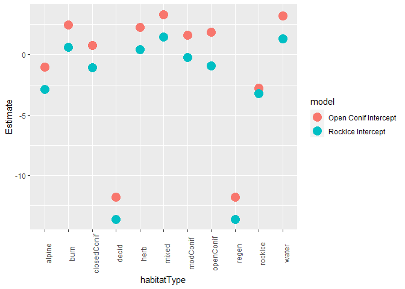<!-- --> This figure
tells us that RELATIVELY nothing has changed, only where the
coefficients are relative to the yAxis

# Homework Excercises

I strongly consider you to work through these excercises for this
landcover lab. ESPECIALLY quesiton 4.

1.  What would be you’re a-priori hypothesis for this lab? In other
    words, based on previous literature, and previous analyses you’ve
    done, what landcover types would you expect wolves to select? In the
    discussion, answer whether the results of your study compare broadly
    well to previous studies (Oakleaf et al. 2006, Hebblewhite et
    al. 2005 – OIKOS), etc.?? How do you relate selection for landcover
    to previous results of selection for habitat suitability indices for
    ungulates? Report differences in landcover between packs as well .

2.  What is your ‘best’ model for categorical habitat types? What are
    the effects of landcover type on wolves? Be sure to write the linear
    part of the logistic regression formula for the top model in the
    results, and for this lab, present the selection data in both
    tabular and categorical form.

3.  Discuss what the effects of changing the reference category in your
    RSF say, from closed conifer to rock and ice, does to your results?
    Develop a figure and table of the results from one other analysis
    with a difference reference category.

**4. What is the relationship between the selection ratio, the
ln(selection ratio), and the beta coefficients estimated from a logistic
regression equation? **

\[hint, you have to go back and redo the landcovSelection2 table
collapsing all 3 burn landcover categories together, and then run
something like this\]

    coef.table
    landcovSelection2
    plot(landcovSelection2$selection, coef.table$Estimate)
